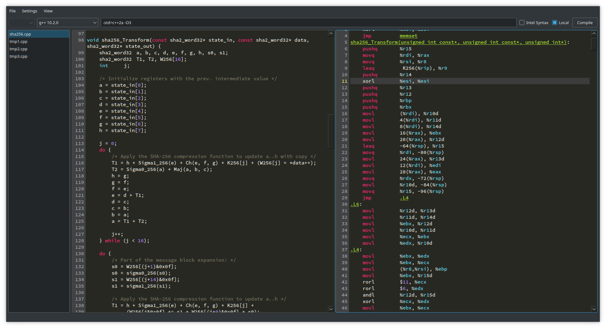

# QCompilerExplorer

Just made this as a fun project. It includes a local mini compiler explorer, which will show you the assembly generated for your C++ code using g++(if g++ is installed). It also includes a frontend for the [Compiler Explorer](https://godbolt.org). You can use either one of them.

## Screenshot



## Building QCompilerExplorer

```shell
git clone https://github.com/Waqar144/QCompilerExplorer.git
cd QCompilerExplorer
git submodule update --init
```

Then download [Qt Creator](http://www.qt.io/download-open-source), open the
project file `qcompilerexplorer.pro` and click on *Build / Run*.

Or you can build it directly in your terminal:

```shell
qmake qcompilerexplorer.pro
make
```

## Missing stuff

- Linking to libraries is not supported for the godbolt frontend. You can link to libraries if you use the local asm generator.
- Written for g++. Works with clang but the output is not as clean
- Asm parsing / cleaning is not very good yet, so there is some noise always
- Will not work on windows in its current state
- No binary execution / output of program

## LICENSE

MIT
